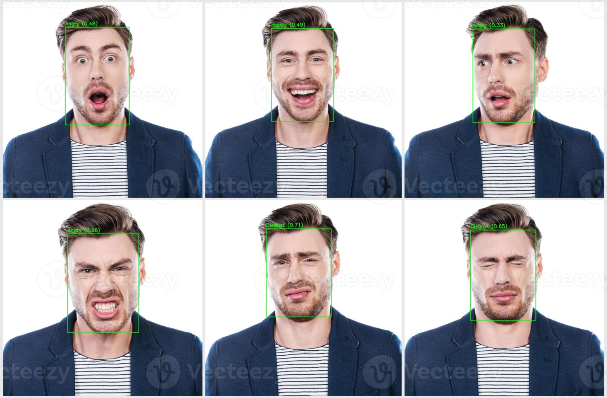
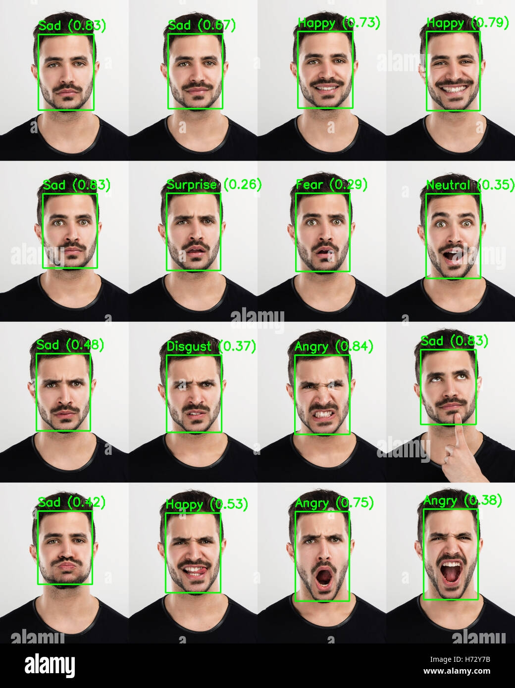
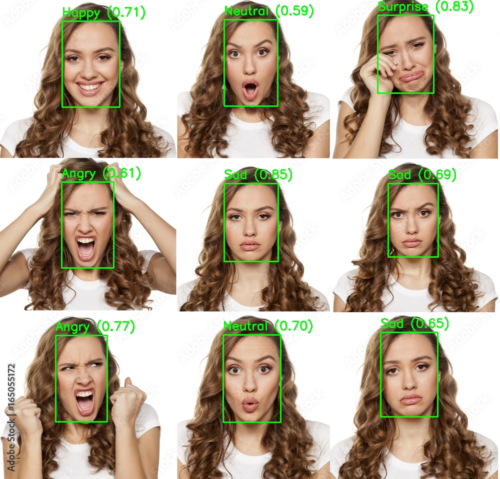

# 🧠 End-to-End Face Emotion Recognition System

An end-to-end computer vision project that detects faces in images and predicts facial emotions using a multi-stage deep learning pipeline. The system combines **YOLO-based face detection** with **ResNet-based emotion classification** and is designed with real-world deployment considerations in mind.

---

## 📌 Project Overview

This project implements a complete facial emotion recognition pipeline where:
- Faces are detected using a YOLO-based object detector trained on the WIDER FACE dataset.
- Each detected face is cropped and preprocessed.
- A ResNet-based deep learning model predicts the emotion for each face.
- Results are visualized with bounding boxes and confidence scores.

The project emphasizes **modular design, transfer learning, and system-level evaluation** rather than isolated benchmark optimization.

---

## 🧠 Pipeline Architecture

Input Image
↓
YOLO Face Detector
↓
Face Bounding Boxes
↓
Face Cropping & Preprocessing
↓
ResNet Emotion Classifier
↓
Emotion Label + Confidence


---

## 📂 Datasets Used

### Face Detection
- **WIDER FACE Dataset**
- Trained in YOLO format for single-class face detection.
- Covers large variations in scale, pose, occlusion, and lighting.

### Emotion Classification
- **FER2013 (image-folder version)**
- 7 emotion classes: Angry, Disgust, Fear, Happy, Sad, Surprise, Neutral.
- Low-resolution and noisy labels, suitable for testing generalization.

---

## 🏗️ Model Details

### Face Detection
- Model: YOLOv8 (single-class: face)
- Input size: 640 × 640
- Trained for high recall to minimize missed faces

### Emotion Classification
- Model: ResNet18 (ImageNet pretrained)
- Transfer learning with **partial fine-tuning**
- Class-weighted loss and label smoothing to handle imbalance and noisy labels

---

## 📊 Evaluation Strategy

- Training and validation accuracy monitored to detect overfitting.
- Best model selected using validation performance.
- Qualitative evaluation performed on unseen real-world images.
- Analysis focused on **error propagation** from detection to classification.

---

## 🖼️ Sample Results

<p align="center">
  
  
  
</p>


*Example outputs showing detected faces with predicted emotions and confidence scores.*


Each image shows:
- Detected face bounding boxes
- Predicted emotion labels
- Confidence scores for predictions

---

## 🌐 Streamlit Web App

A Streamlit application is built to demonstrate real-time face emotion recognition on uploaded images.

🔗 **Streamlit App:**  
`https://face-detection-and-emotion-recognition.streamlit.app/`

The app allows users to:
- Upload an image
- Detect multiple faces
- View emotion predictions with visual overlays

---

## 🛠️ Tech Stack

- **Programming Language:** Python  
- **Deep Learning:** PyTorch, Torchvision  
- **Object Detection:** YOLOv8 (Ultralytics)  
- **Computer Vision:** OpenCV, PIL  
- **Deployment:** Streamlit  
- **Data Handling & Visualization:** NumPy, Matplotlib  

---

## 🚀 How to Run (Local)

1. Clone the repository:
   ```bash
   git clone https://github.com/Hrishikesh-Gaikwad-GG/Face-detection-and-Emotion-recognition.git
   cd Face-detection-and-Emotion-recognition
2. Install dependencies:
   ```bash
    pip install -r requirements.txt
3. Run the Streamlit app:
   ```bash
    streamlit run app.py


⚠️ Limitations

- Emotion labels are subjective and context-dependent.
- FER2013 contains noisy annotations and low-resolution images.
- Detection errors propagate to emotion classification.
- No explicit face alignment is applied before classification.

👤 Author
Hrishikesh Gaikwad
AI/ML Enthusiast
